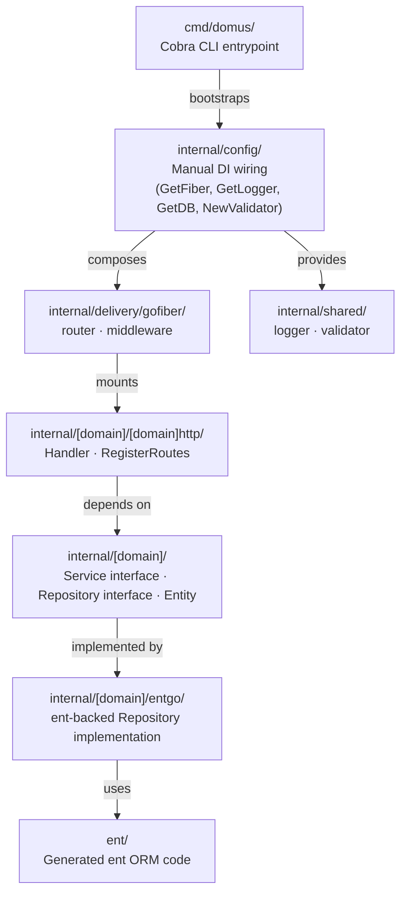

# ADR-002: Go Application Architecture

**Status:** Accepted
**Created:** 2026-05-22
**Revised:** 2026-05-22
**Deciders:** Anthonius Munthi
**Context:** API (`api/`)

---

## Revision History

| Version | Date       | Changes          |
|---------|------------|------------------|
| 1.0     | 2026-05-22 | Initial acceptance |

---

## 1. Context

The Domus API requires a consistent, scalable, and maintainable architecture that:

- Supports multiple business domains (auth, parish, member, finance, etc.) developed independently.
- Decouples business logic from the HTTP delivery mechanism (GoFiber), allowing future framework replacement without rewriting domain code.
- Provides a clear, predictable structure for onboarding new engineers.
- Enforces testability through interface-driven design and generated mocks.
- Supports persistence via `ent` (entgo.io) without leaking ORM concerns into the domain layer.

---

## 2. Decision

Domus API adopts a **Domain-Oriented Layered Architecture** — package-by-feature organisation with explicit delivery layer separation, manual dependency injection, and interface-driven domain boundaries.

This is **not** full Domain-Driven Design (DDD) or Clean Architecture, but intentionally borrows their separation-of-concerns principles at a pragmatic scale appropriate for a parish administration system.

---

## 3. Architecture Overview

### 3.1 Layer Diagram



### 3.2 Module Root

```
github.com/paroki/domus/api
```

---

## 4. Project Structure

```
github.com/paroki/domus/api/
│
├── cmd/
│   └── domus/
│       ├── main.go              # Entry point — calls Execute()
│       ├── root.go              # Cobra root command
│       └── serve.go             # `serve` sub-command — bootstraps and starts server
│
├── ent/                         # ent-generated ORM code (DO NOT edit manually)
│   ├── schema/                  # Hand-authored ent schemas (edit here)
│   │   └── [entity].go
│   ├── client.go
│   └── ...
│
├── internal/
│   │
│   ├── config/                  # Infrastructure wiring — Get* constructors only
│   │   ├── viper.go             # Config struct + GetConfig() via Viper
│   │   ├── fiber.go             # GetFiber(*Config) *fiber.App
│   │   ├── logger.go            # GetLogger(*Config) logger.Logger
│   │   ├── db.go                # GetDB(*Config) *ent.Client
│   │   └── validator.go         # NewValidator() validator.Validator
│   │
│   ├── delivery/
│   │   └── gofiber/
│   │       ├── router.go        # SetupRouter — composes all domain routes
│   │       ├── handler/
│   │       │   └── health.go    # System-level health handler
│   │       ├── middleware/
│   │       │   ├── common.go    # Setup(app, cfg) — registers global middleware
│   │       │   └── cors.go      # NewCORS(*Config) fiber.Handler
│   │       └── response/
│   │           └── response.go  # ADR-001 envelope helpers
│   │
│   ├── shared/
│   │   ├── logger/              # Logger interface + slog implementation
│   │   │   ├── logger.go
│   │   │   └── slog.go
│   │   └── validator/           # Validator interface + v10 implementation
│   │       ├── validator.go
│   │       ├── v10.go
│   │       ├── errors.go
│   │       └── messages_id.go
│   │
│   └── [domain]/                # One directory per business domain
│       │                        # e.g. auth, parish, member, finance, event
│       ├── entity.go            # Domain entity / value objects (pure Go structs)
│       ├── repository.go        # Repository interface (persistence contract)
│       ├── service.go           # Service interface + implementation
│       │
│       ├── [domain]http/        # HTTP delivery for this domain
│       │   ├── handler.go       # Handler struct + action methods
│       │   └── routes.go        # RegisterRoutes(r fiber.Router, h *Handler)
│       │
│       ├── entgo/               # ent-backed repository implementation
│       │   └── repository.go    # Implements [domain].Repository using *ent.Client
│       │
│       └── mocks/               # uber/mock generated mocks (DO NOT edit manually)
│           ├── mock_repository.go
│           └── mock_service.go
│
├── testutil/                    # Shared test helpers (used across all domains)
│   ├── request.go               # Fluent fiber request builder
│   ├── fixture.go               # Fixture / seed data loader
│   └── db.go                    # Test database helper (in-memory / test client)
│
├── taskfile.yml
└── go.mod
```

---

## 5. Layer Definitions

### 5.1 `cmd/domus/`

**Responsibility:** CLI entrypoint only. No business logic.

- Cobra commands wire configuration, logger, DB, and Fiber, then call `gofiber.SetupRouter`.
- The `serve` command is the only command that starts the HTTP server.
- All bootstrap panics (missing config, DB unreachable) surface here before the server starts.

### 5.2 `internal/config/`

**Responsibility:** Infrastructure object construction and manual dependency injection.

- Each file exposes one `Get*` or `New*` constructor function.
- Constructors accept `*Config` and return the concrete infrastructure object.
- No domain logic. No import of domain packages.
- `config.GetDB` returns `*ent.Client`; the caller is responsible for closing it.

```go
// internal/config/db.go
func GetDB(cfg *Config) (*ent.Client, error) {
    client, err := ent.Open(cfg.DB.Driver, cfg.DB.DSN)
    if err != nil {
        return nil, fmt.Errorf("open db: %w", err)
    }
    return client, nil
}
```

### 5.3 `internal/delivery/gofiber/`

**Responsibility:** Global HTTP concerns — middleware, router composition, system-level handlers.

- `router.go` is the single composition root for all HTTP routes.
- It wires domain dependencies and calls each domain's `RegisterRoutes`.
- Domain-agnostic middleware (CORS, requestid, recover) lives in `middleware/`.
- The health handler lives in `handler/health.go` as the only system-level route.
- This package imports domain packages. Domain packages MUST NOT import this package.

```go
// internal/delivery/gofiber/router.go
func SetupRouter(app *fiber.App, cfg *config.Config, log logger.Logger, db *ent.Client) {
    middleware.Setup(app, cfg)

    api := app.Group("/api")

    // system
    healthH := handler.NewHealthHandler(cfg, log)
    api.Get("/health", healthH.Check)

    // auth domain
    authRepo := autentgo.NewRepository(db)
    authSvc  := auth.NewService(authRepo, log)
    authH    := authhttp.NewHandler(authSvc, log)
    authhttp.RegisterRoutes(api, authH)

    // parish domain
    parishRepo := parishentgo.NewRepository(db)
    parishSvc  := parish.NewService(parishRepo, log)
    parishH    := parishhttp.NewHandler(parishSvc, log)
    parishhttp.RegisterRoutes(api, parishH)
}
```

### 5.4 `internal/[domain]/`

**Responsibility:** Business logic contract — interfaces and entities only.

- `entity.go` defines pure Go structs representing the domain model. No ORM tags.
- `repository.go` defines the `Repository` interface — the persistence contract.
- `service.go` defines the `Service` interface and its concrete implementation.
- The service implementation depends only on the `Repository` interface, never on `*ent.Client` directly.
- No import of `fiber`, `ent`, or any infrastructure package is permitted in this layer.

```go
// internal/auth/repository.go
type Repository interface {
    FindByID(ctx context.Context, id uuid.UUID) (*User, error)
    FindByEmail(ctx context.Context, email string) (*User, error)
    Save(ctx context.Context, u *User) (*User, error)
    Delete(ctx context.Context, id uuid.UUID) error
}

// internal/auth/service.go
type Service interface {
    Register(ctx context.Context, input RegisterInput) (*User, error)
    Login(ctx context.Context, input LoginInput) (*TokenPair, error)
    Logout(ctx context.Context, sessionID uuid.UUID) error
}
```

### 5.5 `internal/[domain]/[domain]http/`

**Responsibility:** HTTP handler and route registration for the domain.

- Package name: `[domain]http` (e.g., `package authhttp`, `package parishhttp`).
- `handler.go` contains the `Handler` struct and one method per HTTP action.
- `routes.go` exposes `RegisterRoutes(r fiber.Router, h *Handler)`.
- Handler methods depend on the domain `Service` interface only.
- All responses use `response.*` helpers from ADR-001.
- Input binding and validation happen in the handler; business logic is delegated to the service.

```go
// internal/auth/authhttp/routes.go
package authhttp

func RegisterRoutes(r fiber.Router, h *Handler) {
    auth := r.Group("/auth")
    auth.Post("/oauth2/:provider/redirect", h.OAuthRedirect)
    auth.Get("/oauth2/:provider/callback",  h.OAuthCallback)
    auth.Post("/refresh",                   h.RefreshToken)
    auth.Post("/logout",                    h.Logout)
}
```

### 5.6 `internal/[domain]/entgo/`

**Responsibility:** ent-backed implementation of the domain `Repository` interface.

- Package name: `[domain]entgo` (e.g., `package authentgo`, `package parishentgo`).
- Depends on `*ent.Client` and the generated `ent/` package.
- Maps between ent-generated models and domain entities.
- No business logic. Translation only.

```go
// internal/auth/entgo/repository.go
package authentgo

type repository struct {
    client *ent.Client
}

func NewRepository(client *ent.Client) auth.Repository {
    return &repository{client: client}
}

func (r *repository) FindByID(ctx context.Context, id uuid.UUID) (*auth.User, error) {
    row, err := r.client.User.Get(ctx, id)
    if err != nil {
        return nil, err
    }
    return toEntity(row), nil
}
```

### 5.7 `internal/[domain]/mocks/`

**Responsibility:** Generated mocks for unit testing.

- Generated by `uber/mock` via `go generate`.
- MUST NOT be edited manually.
- Committed to source control.
- One mock file per interface.

```go
// internal/auth/repository.go — generate directive
//go:generate mockgen -source=repository.go -destination=mocks/mock_repository.go -package=mocks
//go:generate mockgen -source=service.go    -destination=mocks/mock_service.go    -package=mocks
```

### 5.8 `internal/shared/`

**Responsibility:** Cross-cutting concerns reusable across all domains.

- `logger/` — `Logger` interface + `slog` implementation + `ContextHandler`.
- `validator/` — `Validator` interface + `V10Validator` + `MessageProvider` + Indonesian messages.
- No domain-specific imports permitted here.

### 5.9 `ent/`

**Responsibility:** ent ORM generated code.

- Default location: `github.com/paroki/domus/api/ent/`.
- `ent/schema/` contains hand-authored schema files — the only files edited manually.
- All other files under `ent/` are generated via `go generate` and MUST NOT be edited manually.
- `*ent.Client` is constructed in `internal/config/db.go` and injected into `entgo` repositories.

### 5.10 `testutil/`

**Responsibility:** Shared test infrastructure used across all domain tests.

See Section 7 for full specification.

---

## 6. Dependency Rules

The following import rules are strictly enforced. Violations MUST be blocked at code review.

| Package | MAY import | MUST NOT import |
|---|---|---|
| `cmd/` | `internal/config`, `internal/delivery/gofiber` | Any domain package directly |
| `internal/config/` | `internal/shared`, `ent/` | Any domain package |
| `internal/delivery/gofiber/` | All domain packages, `internal/config`, `internal/shared` | — |
| `internal/[domain]/` | `internal/shared` | `fiber`, `ent`, any other domain |
| `internal/[domain]/[domain]http/` | `internal/[domain]`, `internal/shared`, `internal/delivery/gofiber/response` | `ent`, other domain packages |
| `internal/[domain]/entgo/` | `internal/[domain]`, `ent/` | `fiber`, other domain packages |
| `internal/shared/` | Standard library, third-party only | Any `internal/` package |
| `ent/` | Standard library, `entgo.io/ent` | Any `internal/` package |

**Key rules:**

- Domain packages (`internal/[domain]/`) are dependency-free from infrastructure.
- `internal/delivery/gofiber/` is the only package that may import multiple domain packages simultaneously.
- Circular imports between domain packages are prohibited.

---

## 7. Testing Strategy

### 7.1 File Naming Conventions

| File Pattern | Test Type | Package Convention |
|---|---|---|
| `*_test.go` | Unit test | `package [domain]_test` (black-box) |
| `*_integration_test.go` | Integration test | `package [domain]_test` |
| `[domain]/mocks/mock_*.go` | Generated mock | `package mocks` |
| `testutil/*.go` | Shared helpers | `package testutil` |

### 7.2 Test Types

**Unit tests** (`*_test.go`)

- Test a single function or method in isolation.
- All external dependencies replaced with generated mocks from `[domain]/mocks/`.
- No real database, no running HTTP server.
- Must run with `go test ./...` without any external infrastructure.

**Integration tests** (`*_integration_test.go`)

- Test the full HTTP layer against a real (or in-memory) database.
- Use `testutil` fluent request builder against `app.Test(req)`.
- Use `testutil.NewTestDB()` for an isolated database client per test.
- May be gated behind a build tag (e.g., `//go:build integration`) if external infra is required.

### 7.3 Mock Generation

Mocks are generated via `uber/mock`. Each domain interface file carries a `//go:generate` directive.

```go
// internal/auth/repository.go
//go:generate mockgen -source=repository.go -destination=mocks/mock_repository.go -package=mocks

// internal/auth/service.go
//go:generate mockgen -source=service.go -destination=mocks/mock_service.go -package=mocks
```

Run all generators from the module root:

```bash
go generate ./...
```

Generated files are committed to source control. CI MUST verify that generated files are up-to-date.

### 7.4 `testutil` Package

#### `testutil/request.go` — Fluent Fiber Request Builder

```go
package testutil

// Usage:
//
//   testutil.New(app).
//       POST("/api/auth/login").
//       WithJSON(body).
//       WithHeader("Authorization", "Bearer token").
//       Expect(t).
//       Status(http.StatusOK).
//       JSONPath("$.success").EqBool(true).
//       JSONPath("$.data.token").Exists()

type RequestBuilder struct {
    app     *fiber.App
    method  string
    path    string
    body    io.Reader
    headers map[string]string
}

func New(app *fiber.App) *RequestBuilder

func (b *RequestBuilder) GET(path string)    *RequestBuilder
func (b *RequestBuilder) POST(path string)   *RequestBuilder
func (b *RequestBuilder) PUT(path string)    *RequestBuilder
func (b *RequestBuilder) PATCH(path string)  *RequestBuilder
func (b *RequestBuilder) DELETE(path string) *RequestBuilder

func (b *RequestBuilder) WithJSON(v any)                        *RequestBuilder
func (b *RequestBuilder) WithBody(r io.Reader, contentType string) *RequestBuilder
func (b *RequestBuilder) WithHeader(key, value string)          *RequestBuilder
func (b *RequestBuilder) WithBearerToken(token string)          *RequestBuilder

func (b *RequestBuilder) Expect(t *testing.T) *AssertionBuilder

type AssertionBuilder struct { ... }

func (a *AssertionBuilder) Status(code int)           *AssertionBuilder
func (a *AssertionBuilder) StatusOK()                 *AssertionBuilder
func (a *AssertionBuilder) StatusCreated()            *AssertionBuilder
func (a *AssertionBuilder) StatusBadRequest()         *AssertionBuilder
func (a *AssertionBuilder) StatusUnauthorized()       *AssertionBuilder
func (a *AssertionBuilder) StatusForbidden()          *AssertionBuilder
func (a *AssertionBuilder) StatusNotFound()           *AssertionBuilder
func (a *AssertionBuilder) JSONPath(expr string)      *JSONAssertionBuilder

type JSONAssertionBuilder struct { ... }

func (j *JSONAssertionBuilder) Exists()             *AssertionBuilder
func (j *JSONAssertionBuilder) EqString(want string) *AssertionBuilder
func (j *JSONAssertionBuilder) EqBool(want bool)    *AssertionBuilder
func (j *JSONAssertionBuilder) EqInt(want int)      *AssertionBuilder
func (j *JSONAssertionBuilder) IsNull()             *AssertionBuilder
func (j *JSONAssertionBuilder) IsArray()            *AssertionBuilder
func (j *JSONAssertionBuilder) HasLen(n int)        *AssertionBuilder
```

#### `testutil/db.go` — Test Database Helper

```go
package testutil

// NewTestDB returns an isolated *ent.Client for use in integration tests.
// Uses SQLite in-memory by default; can be configured via TEST_DB_DSN env var.
// Automatically runs schema migration.
// The returned CloseFunc MUST be called in t.Cleanup().
//
// Usage:
//   client, close := testutil.NewTestDB(t)
//   t.Cleanup(close)

type CloseFunc func()

func NewTestDB(t *testing.T) (*ent.Client, CloseFunc)
```

#### `testutil/fixture.go` — Fixture Loader

```go
package testutil

// Fixture provides seed data helpers for integration tests.
// Fixtures are defined as Go structs, not external files, for type safety.
//
// Usage:
//   fx := testutil.NewFixture(client)
//   user  := fx.CreateUser(t, testutil.UserFixture{Email: "test@example.com"})
//   parish := fx.CreateParish(t, testutil.ParishFixture{Name: "St. Michael"})

type Fixture struct {
    client *ent.Client
}

func NewFixture(client *ent.Client) *Fixture

// Fixture builder methods are defined per domain as the domain is implemented.
// e.g.:
// func (f *Fixture) CreateUser(t *testing.T, input UserFixture) *ent.User
// func (f *Fixture) CreateParish(t *testing.T, input ParishFixture) *ent.Parish
```

### 7.5 Example: Domain Unit Test

```go
// internal/auth/service_test.go
package auth_test

import (
    "context"
    "testing"

    "github.com/paroki/domus/api/internal/auth"
    "github.com/paroki/domus/api/internal/auth/mocks"
    "go.uber.org/mock/gomock"
)

func TestAuthService_Login_Success(t *testing.T) {
    ctrl := gomock.NewController(t)
    defer ctrl.Finish()

    mockRepo := mocks.NewMockRepository(ctrl)
    mockRepo.EXPECT().
        FindByEmail(gomock.Any(), "user@example.com").
        Return(&auth.User{Email: "user@example.com", Status: auth.StatusActive}, nil)

    svc := auth.NewService(mockRepo, nil)
    _, err := svc.Login(context.Background(), auth.LoginInput{
        Email:    "user@example.com",
        Password: "secret123",
    })

    if err != nil {
        t.Fatalf("expected no error, got: %v", err)
    }
}
```

### 7.6 Example: HTTP Integration Test

```go
// internal/auth/authhttp/login_integration_test.go
package authhttp_test

import (
    "net/http"
    "testing"

    "github.com/paroki/domus/api/testutil"
)

func TestLogin_ValidCredentials_Returns200(t *testing.T) {
    db, close := testutil.NewTestDB(t)
    t.Cleanup(close)

    fx  := testutil.NewFixture(db)
    fx.CreateUser(t, testutil.UserFixture{
        Email:    "user@example.com",
        Password: "secret123",
        Status:   "ACTIVE",
    })

    app := newTestApp(db) // local helper that wires the domain and returns *fiber.App

    testutil.New(app).
        POST("/api/auth/email/login").
        WithJSON(map[string]string{
            "email":    "user@example.com",
            "password": "secret123",
        }).
        Expect(t).
        Status(http.StatusOK).
        JSONPath("$.success").EqBool(true).
        JSONPath("$.data.access_token").Exists()
}
```

---

## 8. Configuration

Configuration is managed by Viper. All values are readable from:

1. `config.json` in the working directory.
2. Environment variables prefixed with `DOMUS_` (e.g., `DOMUS_DB_DSN`).

Key configuration groups:

| Group | Description |
|---|---|
| `port` | HTTP server port (default: `8080`) |
| `env` | Application environment: `development`, `production`, `test` |
| `api.*` | Fiber settings: timeouts, body limit, CORS, prefork |
| `log.*` | Logger settings: level, adapter |
| `db.*` | Database settings: driver, DSN |

---

## 9. Code Generation

| Tool | Purpose | Output Location | Run Command |
|---|---|---|---|
| `entgo.io/ent` | ORM schema → Go client | `ent/` | `go generate ./ent/...` |
| `uber/mock` | Interface → mock | `[domain]/mocks/` | `go generate ./...` |

**CI enforcement:** The CI pipeline MUST run `go generate ./...` and fail if any tracked file is modified by the generation step (i.e., generated files must be committed and up-to-date).

```bash
# CI check
go generate ./...
git diff --exit-code
```

---

## 10. Routing Convention

All domain routes are mounted under `/api` and follow RESTful conventions.

| Domain | Base Path | Example |
|---|---|---|
| System | `/api/health` | `GET /api/health` |
| Auth | `/api/auth` | `POST /api/auth/oauth2/:provider/redirect` |
| Parish | `/api/orgs` | `GET /api/orgs/:org_id` |
| Member | `/api/orgs/:org_id/members` | `PATCH /api/orgs/:org_id/members/:user_id/approve` |
| Finance | `/api/orgs/:org_id/finance` | `GET /api/orgs/:org_id/finance/contributions` |
| Events | `/api/orgs/:org_id/events` | `POST /api/orgs/:org_id/events` |

All responses conform to **ADR-001** envelope contract.

---

## 11. Consequences

### 11.1 Positive

- **Framework agnosticism** — Domain logic has zero Fiber dependency. Replacing GoFiber with Gin requires changes only in `[domain]http/` and `internal/delivery/gofiber/`. Domain services and repositories are untouched.
- **Testability** — Interface-driven design and generated mocks make unit tests fast, isolated, and deterministic.
- **Onboarding clarity** — New engineers follow the same pattern for every domain: entity → repository interface → service → entgo → [domain]http.
- **Explicit wiring** — Manual DI in `router.go` makes the full dependency graph visible and traceable without magic.
- **Independent domain development** — Teams can work on separate domains without merge conflicts in infrastructure files.

### 11.2 Negative / Trade-offs

- **Boilerplate per domain** — Each new domain requires at minimum five files (`entity.go`, `repository.go`, `service.go`, `[domain]http/handler.go`, `[domain]http/routes.go`, `entgo/repository.go`). A `task new-domain` scaffolding command is recommended to mitigate this.
- **Manual wiring grows with domains** — `router.go` will accumulate wiring lines as domains grow. This is intentional and traceable, but should be reviewed if it exceeds approximately 150 lines.
- **No runtime DI validation** — Unlike `uber/fx`, misconfigured wiring causes compile-time errors at best and panics at worst. This is acceptable at the current scale.
- **`testutil` is a shared dependency** — Changes to `testutil` interfaces affect all domain tests. Changes must be backward-compatible or coordinated across teams.

---

## 12. Compliance

All new domains introduced after the acceptance date of this ADR **MUST** conform to this structure. Existing code (health handler, middleware, response helpers) is already compliant.

The following violations MUST be blocked at code review:

- Domain package importing `fiber` or `ent` directly.
- Handler method containing inline business logic (must be delegated to service).
- `entgo/` repository implementing logic beyond persistence translation.
- Manually edited files under `ent/` (except `ent/schema/`).
- Manually edited files under `[domain]/mocks/`.
- Missing `//go:generate` directives on interface files.

---

## 13. Related Documents

| Document | Description |
|---|---|
| ADR-001 | API Response Structure Contract |
| PRD-001 | Authentication & Authorization |
| ADR-003 | Auth Architecture (JWT, session, middleware) — to be authored |
| ADR-004 | Multi-tenant & Organization Isolation — to be authored |
| ADR-005 | RBAC & Permission System — to be authored |

---

*Document maintained by the Domus Engineering Team. Review upon any structural change to the application architecture.*
